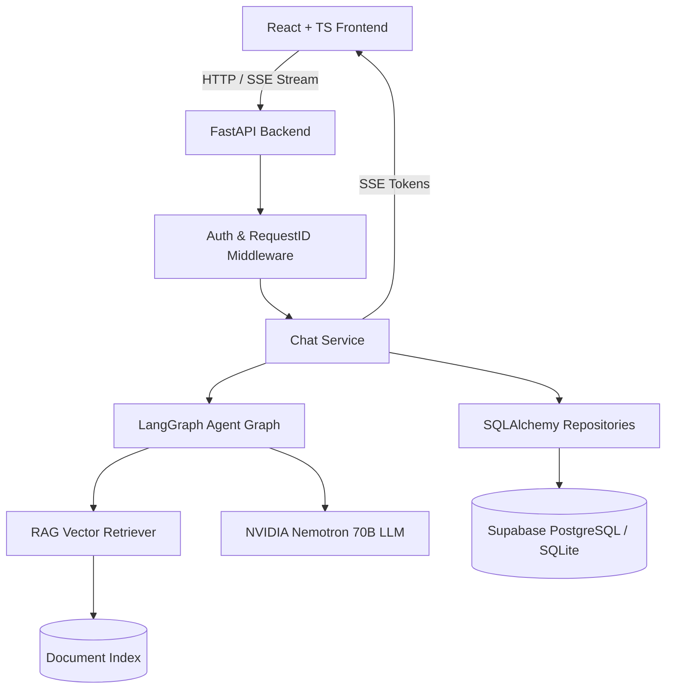
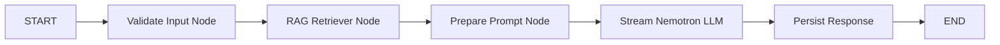
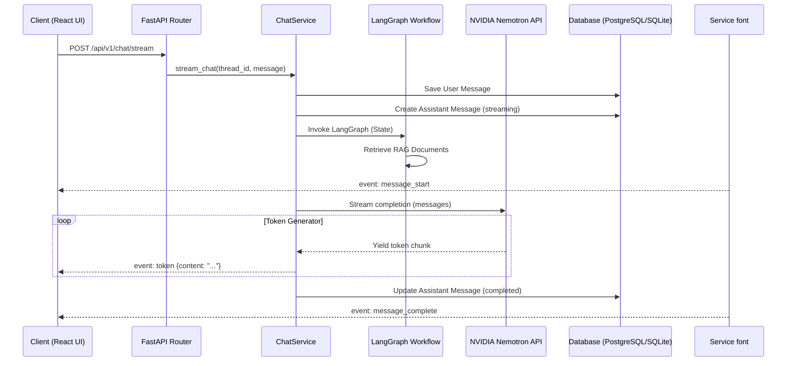

# ANTIGRAVITY — Architecture Specification & Diagrams

ANTIGRAVITY is built on a clean layer-decoupled architecture designed for high performance, real-time SSE streaming, database history persistence, stateful agent workflows via **LangGraph**, and document retrieval (**RAG**) powered by **NVIDIA Nemotron API** models.

## High-Level Topology

## LangGraph Execution Graph

## Real-Time SSE Token Streaming Flow

